# restore.sh – obnova záloh Clonezilly na jiný disk

`restore.sh` (verze 1.1.0) obnoví zálohu Clonezilly na jiný disk, větší i menší, a sám přepočítá oddíly.
U panelů Beckhoff (XP Embedded, WES7, Windows CE) zachová start oddílu na sektoru 63, boot kód,
disk signature a aktivní oddíl, takže systém nabootuje. Zálohu se dvěma kartami (systém + data)
obnoví na jeden disk.

- [Co je potřeba](#co-je-potřeba)
- [Příprava: skript na flashku](#příprava-skript-na-flashku)
- [Spuštění v Clonezille](#spuštění-v-clonezille)
- [Ovládání](#ovládání)
- [Obnova zálohy krok za krokem](#obnova-zálohy-krok-za-krokem)
- [Záloha se dvěma disky na jeden disk](#záloha-se-dvěma-disky-na-jeden-disk)
- [Kontrola výsledku a první start panelu](#kontrola-výsledku-a-první-start-panelu)
- [Řešení problémů](#řešení-problémů)
- [Přehled příkazů](#přehled-příkazů)
- [Pro vývojáře](#pro-vývojáře)

## Co je potřeba

| Co | K čemu | Poznámka |
| --- | --- | --- |
| Flashka s Clonezillou | z ní se bootuje, leží na ní `restore.sh` | skript ji nikdy nenabídne jako cíl |
| Disk se zálohami | obsahuje složky záloh Clonezilly (`…-img`) | připojí se jen pro čtení, nikdy jako cíl |
| Cílový disk | sem se záloha obnoví | **všechna data na něm se smažou** |
| Klávesnice | ovládání skriptu | myš nefunguje |

Při zkoušce ve VMware nabootuje Clonezilla z ISO a flashka i disky se do virtuálu připojí přes
*VM → Removable Devices → Connect*. Disky počítače virtuál nevidí.

## Příprava: skript na flashku

1. Zasuň flashku s Clonezillou do počítače s Windows.
2. Zkopíruj `restore.sh` do kořene flashky – vedle složek `live`, `EFI` a `boot` (přepíšeš starou verzi).
3. Flashku bezpečně odeber.

Soubor otevírej jen ve VS Code nebo Notepad++: má linuxové konce řádků (LF). Kdyby se při uložení
změnily na Windows (CRLF), skript to při startu sám ohlásí a nespustí se.

## Spuštění v Clonezille

Skript se spouští z příkazového řádku Clonezilly. Cesta k němu začíná lomítkem: `/mnt/restore.sh`.

1. Připoj flashku, disk se zálohami a cílový disk (ve VMware: *VM → Removable Devices → Connect*).
2. Nabootuj Clonezillu: první položka menu (Enter), jazyk, klávesnice *Keep*, potom **Enter_shell** a **cmd**.
3. Najdi flashku – řádek s `usb` a její oddíl typu `vfat`:
   ```
   lsblk -o NAME,SIZE,TRAN,FSTYPE,LABEL
   ```
4. Připoj ji a zkontroluj, že na ní je `restore.sh` (místo `sda1` dej oddíl z předchozího výpisu):
   ```
   sudo mount /dev/sda1 /mnt
   ls /mnt
   ```
   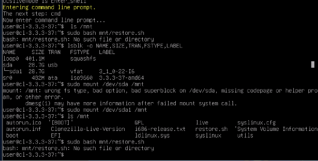

   Na screenshotu je poslední příkaz špatně (`mnt/restore.sh` bez lomítka) – proto hláška *No such file or directory*.
5. Spusť skript. Poprvé doporučuji režim nanečisto, který nic nezapíše:
   ```
   sudo bash /mnt/restore.sh --dry-run
   sudo bash /mnt/restore.sh
   ```

## Ovládání

Vše se ovládá klávesnicí, myš v okně nefunguje. Ve VMware nejdřív jednou klikni do okna virtuálu,
aby dostalo klávesnici (zpět do Windows: Ctrl+Alt).

| Klávesa / tlačítko | Co dělá |
| --- | --- |
| **číslo** nebo **šipky ↑ ↓** | výběr položky; hlavní menu má volby 0–9 |
| **Enter** | potvrdí zvýrazněné tlačítko |
| **Tab** | přepne mezi tlačítky (např. *Vybrat* / *< Zpět*) |
| **Esc** | zpět o krok |
| *Vybrat* / *< Zpět* | tlačítka v nabídkách |
| *Další >* | zavře informační okno (tabulku, souhrn) a pokračuje |
| *Ano* / *Ne* | odpověď na otázku |
| *Potvrdit* | potvrdí zadanou hodnotu (velikost, název disku) |

Horní řádek obrazovky ukazuje, kde právě jsi, např. *krok 3/6: cílový disk*. Skript při startu prohodí
klávesy **Y a Z** jako na české klávesnici; ostatní klávesy (čísla, lomítka) zůstávají americké.

## Obnova zálohy krok za krokem

Obnova má 6 kroků a až do kroku 5 se na disk nic nezapisuje. Obrázky jsou z verze 1.1.0
(příklad: záloha dvou CF karet panelu na jeden SSD).

**Hlavní menu** – zvol **1 Obnovit obraz na disk**.

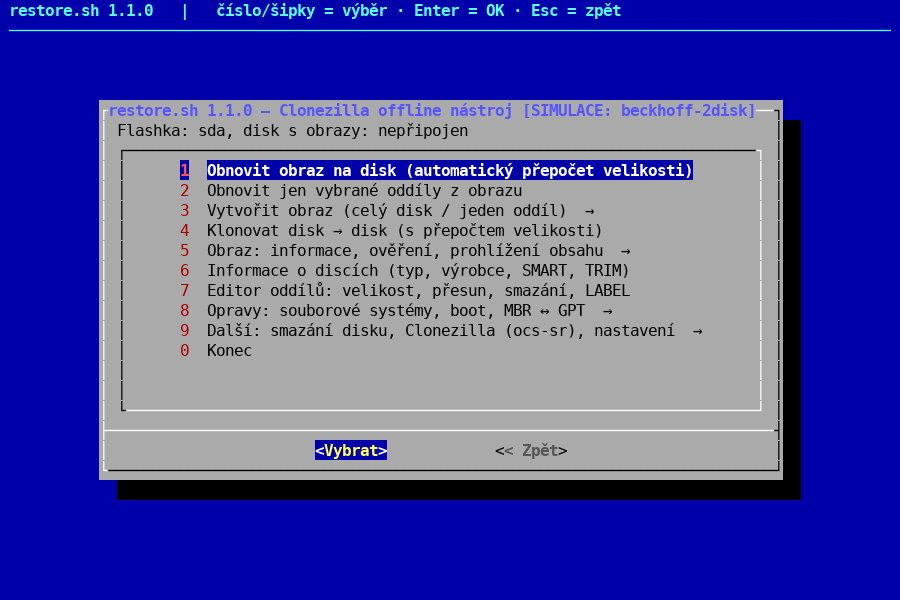

**Krok 1 – disk se zálohami.** Vyber oddíl, na kterém jsou zálohy. Nevíš-li který, zvol
*Automaticky prohledat* – skript projde všechny oddíly jen pro čtení a vypíše nalezené zálohy.

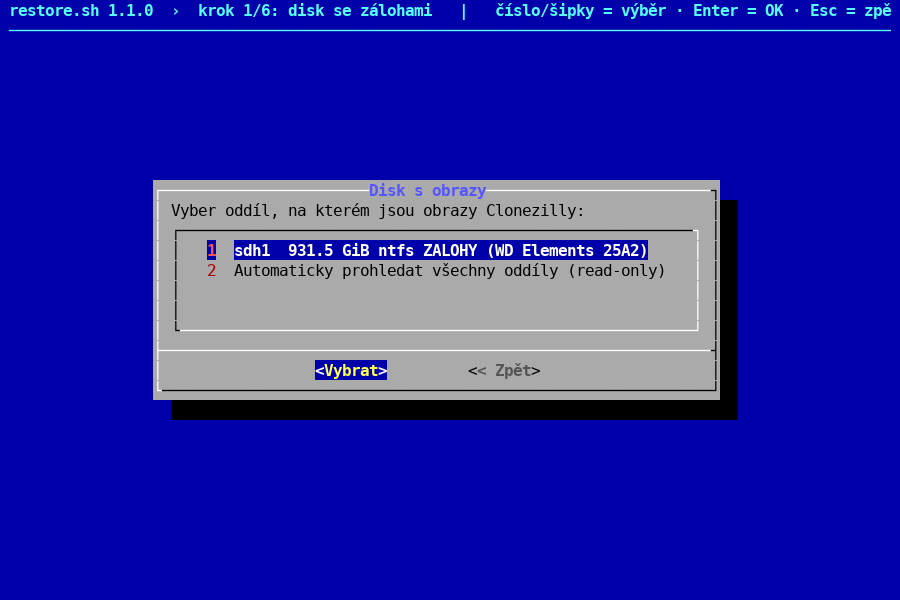

**Krok 2 – výběr zálohy.** U každé zálohy je datum, disky a oddíly. Koš Windows se neprohledává.

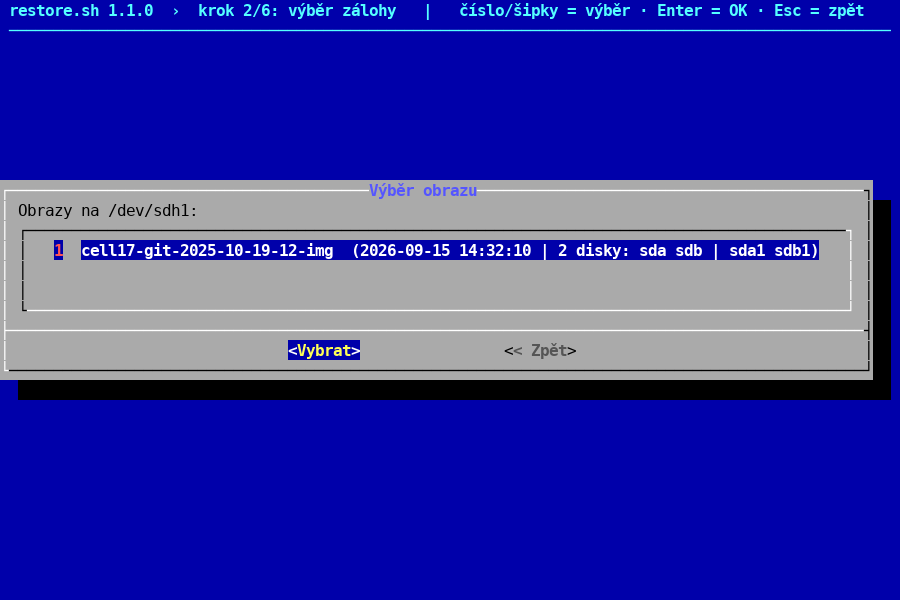

Následuje přehled zálohy (oddíly, souborové systémy, obsazené místo) – pokračuj *Další >*.
Obsahuje-li záloha dva disky, skript se zeptá, jak je obnovit
(viz [Záloha se dvěma disky](#záloha-se-dvěma-disky-na-jeden-disk)).

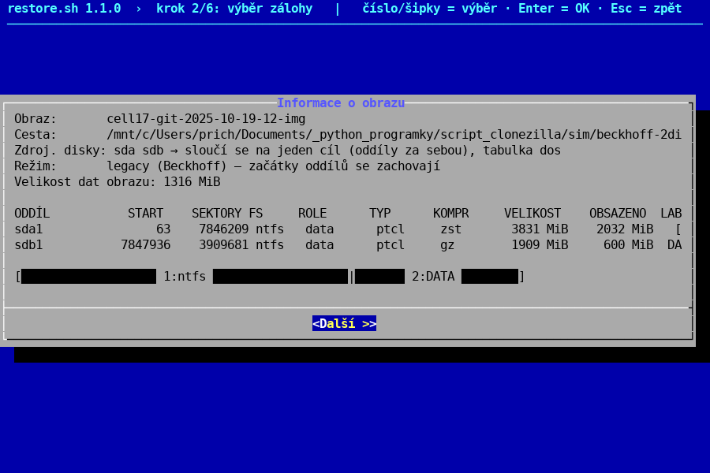

**Krok 3 – cílový disk.** U každého disku je typ, výrobce, model a sériové číslo. Flashka s Clonezillou
a disk se zálohami jsou označené *CHRÁNĚNO* a vybrat nejdou. Disk s připojeným oddílem skript nabídne odpojit.

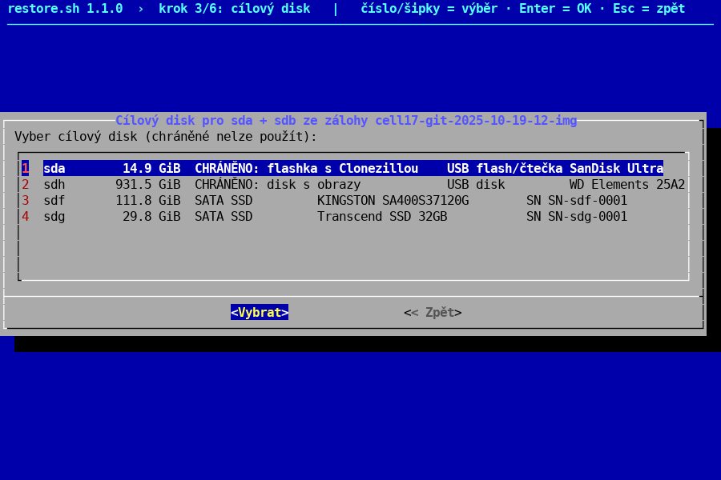

**Krok 4 – velikost oddílů.**

| Volba | Kdy ji použít |
| --- | --- |
| 1 – zbytek disku | běžný případ: největší datový oddíl zabere volné místo |
| 2 – poměrem | více oddílů, každý se zvětší ve stejném poměru |
| 3 – zadat ručně | velikost každého oddílu zadáš sám (`20G`, `15000M`, `50%`, `max`) |
| 4 – beze změny | stejné velikosti jako v záloze, jen když se vejdou |

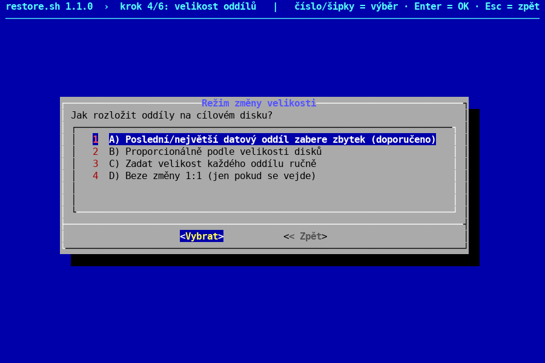

**Krok 5 – kontrola a potvrzení.** Souhrn ukazuje cílový disk a tabulku původní → nová velikost.
Zkontroluj model a sériové číslo. Pro potvrzení opiš název disku (např. `sdf`) – až teď se začne zapisovat.

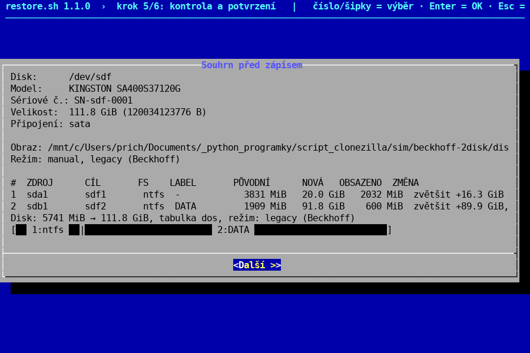

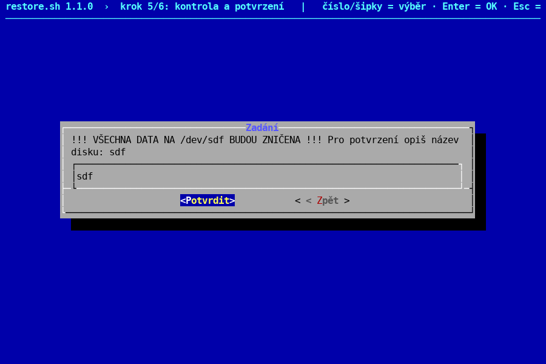

**Krok 6 – obnova.** Skript zapíše tabulku oddílů, obnoví data, rozšíří souborové systémy a opraví
bootování. Na konci je souhrn s varováními a cestou k logu.

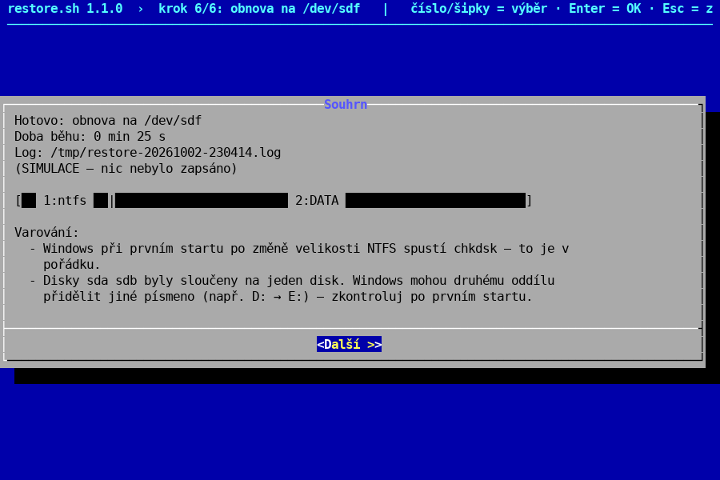

## Záloha se dvěma disky na jeden disk

Záloha panelu se dvěma kartami (systém + data) se obnoví na jeden cílový disk jako dva oddíly za sebou.
Bootovací kartu skript pozná sám a dá ji na první místo: zachová start na sektoru 63, boot kód,
disk signature a aktivní příznak. Druhému oddílu opraví *hidden sectors*, protože se mu změní pozice.

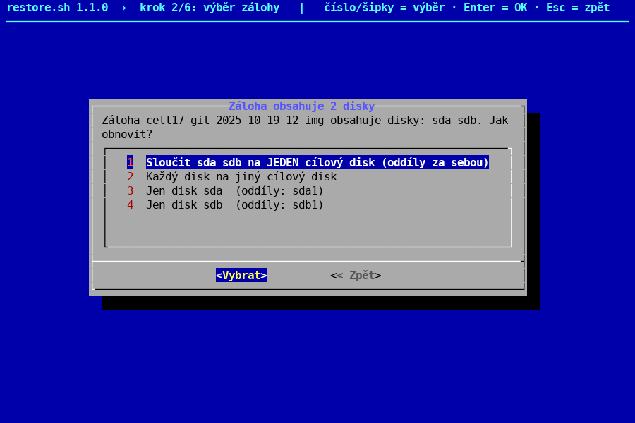

| Volba | Výsledek |
| --- | --- |
| 1 – Sloučit na JEDEN disk | oba oddíly na jeden cílový disk (systém + data) |
| 2 – Každý disk zvlášť | každá karta na vlastní cílový disk |
| 3 / 4 – Jen jeden disk | obnoví jen vybranou kartu |

**Velikost obou oddílů** nastavíš v kroku 4 volbou **3 – zadat ručně**. Skript se zeptá postupně na každý
oddíl a ukáže obsazené místo, minimum a kolik zbývá. Předvyplněnou hodnotu smaž (Backspace) a napiš novou:

- `20G` = 20 GiB, `15000M` = 15 000 MiB, `50%` = polovina disku,
- `max` = vše, co zbývá (u posledního oddílu je předvyplněno).

Méně než minimum skript nepřijme a zeptá se znovu.

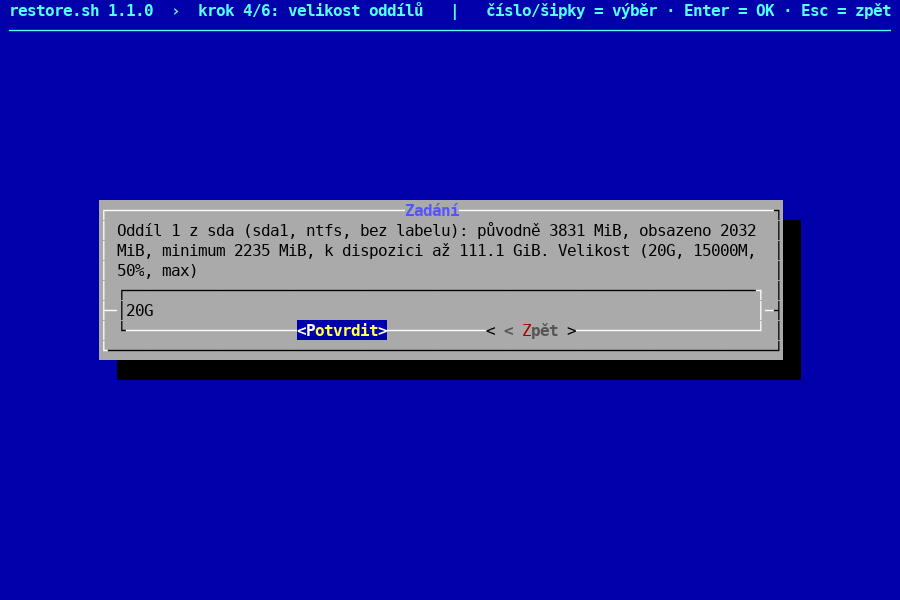


Potom ukáže rozložení původní → nové a pruh disku. Když nesedí, dej *< Zpět* (Esc) – nic se zatím nezapsalo.

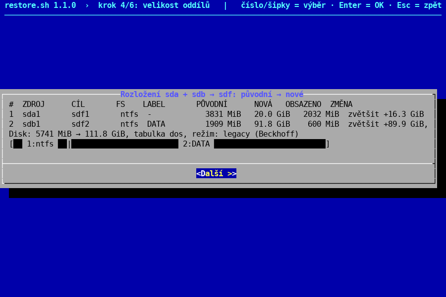

Windows mohou datovému oddílu po sloučení přidělit jiné písmeno (např. E: místo D:).
Po prvním startu ho zkontroluj ve Správě disků.

## Kontrola výsledku a první start panelu

Před vložením disku do panelu zkontroluj tabulku oddílů. V Clonezille (po ukončení skriptu volbou 0):

```
sudo sfdisk -d /dev/sdf
sudo ntfsresize --info --force /dev/sdf1
```

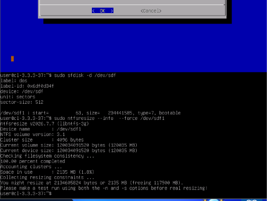

| Co zkontrolovat | Správně | Kde to vidíš |
| --- | --- | --- |
| Začátek 1. oddílu | `start=63` (jako na CF kartě) | `sfdisk -d` |
| Aktivní oddíl | `bootable` u 1. oddílu | `sfdisk -d` |
| Disk signature | stejná jako v záloze (`label-id`) | `sfdisk -d`, ve Windows `Get-Disk` |
| Velikost NTFS | *Current volume size* ≈ *device size* | `ntfsresize --info` |
| Hidden sectors | rovná se začátku oddílu (63, resp. start 2. oddílu) | skript kontroluje a opravuje sám |

Při kontrole ve Windows ukazují oba svazky stav *Warning*. To je správně: po změně velikosti je NTFS
označen ke kontrole. Na počítači, kde disk kontroluješ, nic neopravuj.

**První start panelu:** vlož disk místo CF karty a zapni panel. Windows spustí chkdsk, nech ho doběhnout
(může restartovat). Pak zkontroluj písmena disků a licenci TwinCAT – je vázaná na hardware panelu.

## Řešení problémů

| Problém | Příčina | Řešení |
| --- | --- | --- |
| *No such file or directory* při spuštění | chybí lomítko: `mnt/restore.sh` | `sudo bash /mnt/restore.sh` |
| *wrong fs type* při `mount` | připojuješ celý disk (`/dev/sda`) | připoj oddíl: `/dev/sda1` |
| Klik myší nic nedělá | rozhraní je jen na klávesnici | šipky / číslo + Enter; ve VMware nejdřív klik do okna (Ctrl+G) |
| Ve výběru není očekávaná záloha | záloha je hlouběji než 3 složky nebo na jiném oddílu | volba *Automaticky prohledat*; kontrola: `sudo find /zal -maxdepth 8 -name parts` |
| Záloha v `$RECYCLE.BIN` | smazaná záloha v koši Windows | verze 1.1.0 koš přeskakuje |
| Cílový disk je *CHRÁNĚNO* | flashka, disk se zálohami nebo připojený oddíl | připojený oddíl skript nabídne odpojit |
| *Data se nevejdou … Nic nebylo zapsáno* | cílový disk je menší než data | větší disk nebo menší velikosti v režimu 3 |
| Chybí místo pro dočasný soubor | zmenšení potřebuje místo ≈ obsazená data + 10 % | parametr `--tmpdir /cesta` na disk s místem |
| Ve Windows *Warning* u NTFS | NTFS označen ke kontrole po změně velikosti | v pořádku, chkdsk doběhne při 1. startu panelu |
| Y a Z prohozené | klávesnice Clonezilly je americká | skript je prohodí sám; vypnout: `--keymap us` |

Log každého běhu je v `/tmp/restore-<datum>.log` a kopie ve složce `restore-logs/` na flashce.
Při chybě ho přilož k hlášení.

## Přehled příkazů

| Příkaz | Co dělá |
| --- | --- |
| `sudo bash /mnt/restore.sh` | interaktivní menu |
| `sudo bash /mnt/restore.sh --dry-run` | jen vypíše, co by se provedlo, nic nezapíše |
| `--source-dev /dev/sdh1 --image ZÁLOHA --target sdf --mode last --yes-i-know sdf` | obnova bez menu |
| `--mode manual --sizes 20G,max` | záloha se 2 disky na jeden disk s danými velikostmi |
| `--target sdf,sdg` | každý disk ze zálohy na vlastní cíl |
| `--source-disk sdb` | jen jeden disk ze zálohy |
| `--save-disk sda --name NÁZEV` / `--save-part sda2 --name NÁZEV` | záloha disku / oddílu ve formátu Clonezilly |
| `--resize sdf2 --size -20G\|+50G\|200G\|max\|60% --yes-i-know sdf` | změna velikosti oddílu |
| `--move sdf3 --start end\|start\|<MiB> --yes-i-know sdf` | přesun oddílu |
| `--edit sdf` | editor oddílů |
| `--list-disks` / `--list-images` / `--info ZÁLOHA` | výpis disků / záloh / detail zálohy |
| `--keymap us` | nepřehazovat Y a Z |
| `--tmpdir /cesta` | místo pro dočasný soubor při zmenšování |

Automatické spuštění po bootu (volitelné): do parametrů jádra v `syslinux/syslinux.cfg` a
`boot/grub/grub.cfg` na flashce přidej `ocs_live_run="sudo bash /run/live/medium/restore.sh"`.

## Pro vývojáře

### Struktura

| Soubor | Obsah |
| --- | --- |
| `restore.sh` | celý nástroj (jeden soubor, bash 4+) |
| `test/test-sim.sh` | 39 kontrol v simulaci – funguje i v Git Bash na Windows |
| `test/test-loop.sh` | 185 kontrol na skutečných datech (loop disky, Linux/WSL2, root) |
| `test/make-sim-fixtures.sh` | vygeneruje simulační scénáře do `sim/` |
| `test/screenshots.py` | nasnímá obrazovky do `docs/img/` (pyte + Pillow) |
| `sim/<scénář>/` | fixtures: `lsblk.P`, `sfdisk/*.dump`, obsah disku se zálohami |
| `simulace.cmd` | spuštění simulace ve WSL dvojklikem |
| `ZADANI_restore(1).md` | zadání |

### Simulace (bez rootu, nic nezapisuje)

```
bash restore.sh --simulate=beckhoff-2disk
```

Scénáře: `bigger`, `smaller`, `toosmall`, `windows`, `noimage`, `mounted`, `beckhoff-xp`,
`beckhoff-ce`, `beckhoff-w7`, `beckhoff-2disk`. Na Windows: `simulace.cmd beckhoff-xp`.

### Testy

```
bash test/test-sim.sh                     # simulace
sudo bash test/test-loop.sh               # skutečná data na loop discích
shellcheck restore.sh test/*.sh
python3 test/screenshots.py docs/img      # obrázky do návodu
```

`test-loop.sh` pracuje jen se soubory v `/var/tmp/restore-test` a spouští skript s `--allow-loop`,
kdy jsou všechny skutečné disky chráněné.

### Ověřeno

- Ve VMware Workstation s Clonezillou 3.3.3-37: obnova 4GB CF karty Beckhoff (XP, start 63) na 120GB SSD
  a záloha se dvěma kartami na jeden SSD (kontrola tabulky, signatury a hidden sectors ve Windows).
- Neověřeno na skutečném hardwaru: oprava EFI záznamů, reinstalace GRUB, převod MBR ↔ GPT,
  NVMe format / ATA secure erase – používej nejdřív s `--dry-run`.

### Konce řádků

`restore.sh` musí mít LF. Hlídají to `.editorconfig` a `.gitattributes`; při CRLF skript na startu
ohlásí chybu (kód 1).
